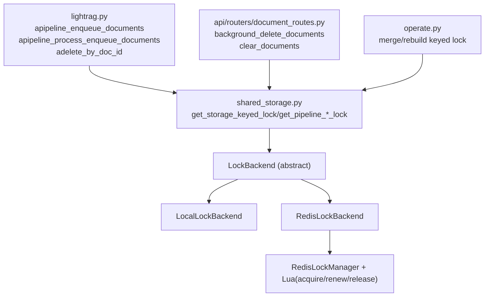

# 项目变更记录

## 一、原始 LightRAG 核心库

本项目基于 LightRAG 开源核心库（`__version__ = 1.4.11`，来源：[HKUDS/LightRAG](https://github.com/HKUDS/LightRAG)）进行定制，保留原始主流程与抽象边界（storage / retrieval / llm）。

原始核心库关键文件与职责如下：

- `lightrag.py`：系统主编排入口，负责文档插入、队列处理、查询执行、存储回调。
- `operate.py`：核心算法实现，包含 chunk 切分、实体关系抽取、图向量混合检索、图合并与重建。
- `base.py`：抽象层定义（KV / Vector / Graph / DocStatus 等基类与数据结构）。
- `kg/`：具体存储后端实现（Neo4j、Qdrant、Mongo、Redis 等）及共享状态机制。
- `llm/`：各模型调用适配层（OpenAI 格式接口、本地模型接入等）。
- `api/`：HTTP 路由层，负责上传、扫描、删除、清空、状态查询等接口封装。

原始并发控制方案主要在 `kg/shared_storage.py`：

- `UnifiedLock` / `KeyedUnifiedLock`：进程内与多进程共享锁统一封装。
- `NamespaceLock`：基于 namespace 的可复用上下文锁。
- `get_namespace_data` + `pipeline_status`：用共享字典维护 `busy / request_pending / cancellation_requested / history_messages` 等运行态。
- 该机制可覆盖单机进程内/多进程并发，但默认不具备跨实例（多服务节点）互斥能力。

## 二、本次改造概述

用 Redis 分布式锁替换原有本地/多进程共享锁方案，支持多实例部署下的并发安全。

## 三、新增文件清单

### 1) `kg/lock_backend.py`

- 文件路径：`kg/lock_backend.py`
- 文件职责：定义统一锁抽象接口与本地后端适配器，屏蔽业务层对具体锁实现的感知。
- 主要类/函数：
  - `LockBackend`（抽象接口）
  - `LocalLockBackend`（本地锁适配）
  - `LockLease`（锁租约结构）
  - `LockBackendError / LockBackendUnavailable / LockLostError`（异常定义）
- 依赖关系：
  - 被 `kg/shared_storage.py` 引用作为后端统一入口。
  - 被 `kg/redis_lock_backend.py` 复用接口与数据结构。
  - 被 `lightrag.py` / `api/.../document_routes.py` 间接使用（通过 shared_storage helper）。

### 2) `kg/redis_lock_backend.py`

- 文件路径：`kg/redis_lock_backend.py`
- 文件职责：提供 Redis 分布式锁实现（acquire / renew / release 原子语义 + 自动续期）。
- 主要类/函数：
  - `RedisLockOptions`
  - `RedisLockManager`
  - `RedisLockBackend`
  - Lua 脚本：`ACQUIRE_LUA` / `RENEW_LUA` / `RELEASE_LUA`
- 依赖关系：
  - 实现 `LockBackend` 接口并由 `kg/shared_storage.py` 动态装配。
  - 使用 `redis.asyncio` 客户端。
  - 支持 `fallback_local` 时回退到 `LocalLockBackend`。

## 四、修改文件清单

### 1) `kg/shared_storage.py`

- 文件路径：`kg/shared_storage.py`
- 修改类/函数：
  - `configure_lock_backend`
  - `get_lock_backend`
  - `_BackendKeyedLockContext`（`__aenter__ / __aexit__ / raise_if_lost` 等）
  - `get_storage_keyed_lock`
  - `get_pipeline_runtime_lock`
  - `get_pipeline_enqueue_lock`
- 修改前行为：
  - 主要依赖本地/多进程共享锁（`KeyedUnifiedLock`）。
  - pipeline runtime / enqueue 无统一分布式后端装配。
  - 无统一 lease-lost 感知与中断传播机制。
- 修改后行为：
  - 可按配置选择 `local` 或 `redis` 锁后端。
  - runtime/enqueue 锁走统一 helper，支持 workspace 级 key 规则与 TTL。
  - `_BackendKeyedLockContext` 新增租约丢失监测与 `LockLostError` 传播。
  - 支持锁续期间隔、等待超时、重试参数的环境变量配置。
- 向后兼容性：
  - **兼容**。原 `get_storage_keyed_lock(...)` 调用方式保留；默认后端仍可为 `local`。

### 2) `lightrag.py`

- 文件路径：`lightrag.py`
- 修改类/函数：
  - `apipeline_enqueue_documents`
  - `apipeline_process_enqueue_documents`
  - `adelete_by_doc_id`
- 修改前行为：
  - pipeline 并发门禁主要依赖本地 `pipeline_status.busy`。
  - runtime 锁在跨实例场景不具备确定互斥。
  - 失锁场景缺少显式异常感知。
- 修改后行为：
  - enqueue 临界区增加 `pipeline:enqueue` 锁保护。
  - pipeline 处理与删除路径统一使用 `pipeline:runtime` 锁。
  - pipeline 主循环增加 `raise_if_lost()` 检查，失锁时抛出 `LockLostError` 并记录状态。
- 向后兼容性：
  - **兼容**。原业务接口保留，新增参数/逻辑不破坏现有调用约定。

### 3) `api/routers/document_routes.py`

- 文件路径：`api/routers/document_routes.py`
- 修改类/函数：
  - `background_delete_documents`
  - `clear_documents`
  - `request_pending` 状态处理逻辑
- 修改前行为：
  - API 层锁获取后存在 try/finally 外业务窗口，异常路径可能延后释放。
  - `request_pending` 在 finally 中先清零后读取，导致分支判断失效。
  - `pending_requests` / `request_pending` 存在命名漂移风险。
- 修改后行为：
  - 获取 runtime lock 后逻辑统一纳入 `try/finally`，确保释放路径一致。
  - 先读取 `has_pending_request` 再清零 `request_pending`，语义正确。
  - 命名统一为 `request_pending`。
- 向后兼容性：
  - **兼容**。API 路由与请求参数未改变，仅修复并发控制与状态时序。

## 五、新增环境变量汇总表

| 变量名 | 默认值 | 含义 | 推荐生产值 |
|---|---:|---|---|
| `LIGHTRAG_LOCK_BACKEND` | `local` | 锁后端类型（`local` / `redis`） | `redis` |
| `LIGHTRAG_LOCK_FAIL_MODE` | `strict` | Redis 异常时策略（`strict`/`fallback_local`） | `strict` |
| `LIGHTRAG_LOCK_KEY_PREFIX` | `lightrag:lock` | Redis 锁 key 前缀 | `lightrag:lock`（按环境可加项目前缀） |
| `LIGHTRAG_LOCK_DEFAULT_TTL_S` | `45` | 通用 keyed lock 默认 TTL（秒） | `45`~`120`（按任务时长校准） |
| `LIGHTRAG_LOCK_RENEW_INTERVAL_S` | `None`（自动 `ttl/3`） | 自动续期心跳间隔（秒） | `ttl/3` 或固定 `10~20` |
| `LIGHTRAG_LOCK_MAX_RETRIES` | `None`（不限制次数） | 获取锁最大重试次数 | 按接口 SLA 设定（如 `50`） |
| `LIGHTRAG_LOCK_LOST_CHECK_INTERVAL_S` | `0.5` | 本地 lease.lost 轮询间隔（秒） | `0.2`~`0.5` |
| `LIGHTRAG_PIPELINE_RUNTIME_LOCK_TTL_S` | `120` | pipeline runtime 锁 TTL（秒） | `120`~`300` |
| `LIGHTRAG_PIPELINE_RUNTIME_LOCK_RETRY_S` | `0.1` | runtime 锁重试间隔（秒） | `0.1`~`0.5` |
| `LIGHTRAG_PIPELINE_RUNTIME_LOCK_WAIT_TIMEOUT_S` | `0.0` | runtime 锁等待超时（秒，`0` 为 non-blocking） | `0`（推荐） |
| `LIGHTRAG_PIPELINE_ENQUEUE_LOCK_TTL_S` | `60` | enqueue 锁 TTL（秒） | `60`~`120` |
| `LIGHTRAG_PIPELINE_ENQUEUE_LOCK_RETRY_S` | `0.1` | enqueue 锁重试间隔（秒） | `0.05`~`0.2` |
| `LIGHTRAG_PIPELINE_ENQUEUE_LOCK_WAIT_TIMEOUT_S` | `None` | enqueue 锁等待超时（秒，`None` 为一直等待） | `1~5`（避免长阻塞） |

> 说明：`REDIS_URI` 为 Redis 连接地址，属于接入 Redis 的前置配置，本表聚焦锁改造新增/新增使用的变量。

## 六、锁分层结构说明



## 七、关键并发保护点说明

### 1) 文档入队（enqueue）

- 保护锁：`pipeline:enqueue`
- 入口：`get_pipeline_enqueue_lock(...)`
- key 规则：`{prefix}:{workspace}:pipeline:enqueue`
- TTL：`LIGHTRAG_PIPELINE_ENQUEUE_LOCK_TTL_S`（默认 60s）

### 2) 文档处理（pipeline runtime）

- 保护锁：`pipeline:runtime`
- 入口：`get_pipeline_runtime_lock(...)`
- key 规则：`{prefix}:{workspace}:pipeline:runtime`
- TTL：`LIGHTRAG_PIPELINE_RUNTIME_LOCK_TTL_S`（默认 120s）

### 3) 图节点合并（entity/relation keyed lock）

- 保护锁：`get_storage_keyed_lock(...)`（`namespace={workspace}:GraphDB`）
- 入口：
  - `operate.py::_locked_process_entity_name`
  - `operate.py::_locked_process_edges`
  - `operate.py::_locked_rebuild_entity`
  - `operate.py::_locked_rebuild_relationship`
- key 规则：
  - 实体：`{prefix}:{workspace}:GraphDB:{entity_name}`
  - 关系：`{prefix}:{workspace}:GraphDB:{sorted(src,tgt)...}`（按排序后的多 key 逐个加锁）
- TTL：`LIGHTRAG_LOCK_DEFAULT_TTL_S`（默认 45s，可由调用处覆盖）

### 4) 文档删除

- 保护锁：`pipeline:runtime`
- 入口：
  - `lightrag.py::adelete_by_doc_id`
  - `api/...::background_delete_documents`（批量删除统一先持有 runtime 锁）
- key 规则：`{prefix}:{workspace}:pipeline:runtime`
- TTL：默认 120s，自动续期

### 5) 批量清空

- 保护锁：`pipeline:runtime`
- 入口：`api/...::clear_documents`
- key 规则：`{prefix}:{workspace}:pipeline:runtime`
- TTL：默认 120s，自动续期

## 八、已知风险与局限性

- `lease.lost` 无强制中断（当前状态）：主 pipeline 已加入中断检查与传播，但若存在未覆盖 checkpoint 的超长业务段，仍可能出现感知延迟窗口。
- TTL 与任务时长耦合：TTL 过短会误判失锁，过长会放大死锁恢复时间，需要按真实任务分布校准。
- `fallback_local` 不是强一致：仅用于降级可用性，不保证多实例互斥，一致性要求高的生产环境应使用 `strict`。
- Redis 主从切换窗口期：故障切换期间可能出现短暂锁状态不一致，需要通过部署架构与监控补偿。

## 九、测试文件说明

### 1) `tests/locks/conftest.py`

- 路径：`tests/locks/conftest.py`
- 测试类型：测试基础设施（fixture）
- 依赖：`fakeredis`、`pytest`、`pytest-asyncio`
- 作用：
  - `fake_redis` fixture
  - `local_backend` fixture
  - `redis_backend_factory(fail_mode=...)` fixture

### 2) `tests/locks/test_redis_lock_backend_unit.py`

- 路径：`tests/locks/test_redis_lock_backend_unit.py`
- 测试类型：单元测试
- 依赖：`fakeredis` + `pytest-asyncio` + `mock`
- 覆盖：
  - acquire / release / renew
  - token 防误释放
  - auto-renew 取消
  - `lease.lost` 与 `LockLostError` 触发

### 3) `tests/locks/test_shared_storage_backend_context.py`

- 路径：`tests/locks/test_shared_storage_backend_context.py`
- 测试类型：单元测试
- 依赖：`pytest-mock`（AsyncMock/Mock） + `pytest-asyncio`
- 覆盖：
  - `_BackendKeyedLockContext` 异常释放
  - `lease.lost` 中断
  - 多 key 获取失败回滚

运行命令（仅锁测试）：

```powershell
uv --project D:\AllForLearning\lightrag run --group test --directory D:\AllForLearning pytest D:\AllForLearning\lightrag\tests\locks -q
```

## 十、尚未实现的功能

本次改造仅覆盖“分布式并发锁替换与稳定性补完”，以下功能明确未纳入：

- agent 工具编排（向量检索/图查询/新闻抓取/交易工具编排）
- 历史记忆检索与对话长期记忆机制
- crawler / 新闻抓取与外部实时数据接入
- 经济领域 schema 建模与领域知识标准化
- 前端界面与交互层改造

